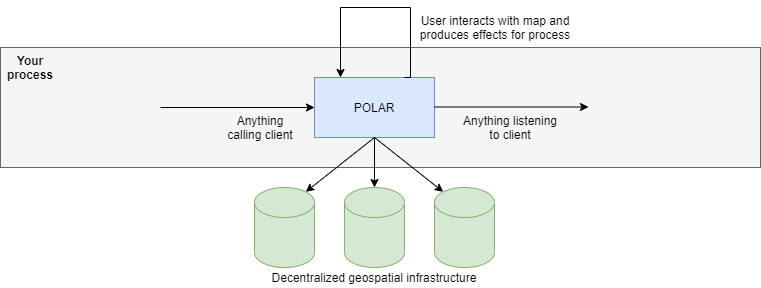
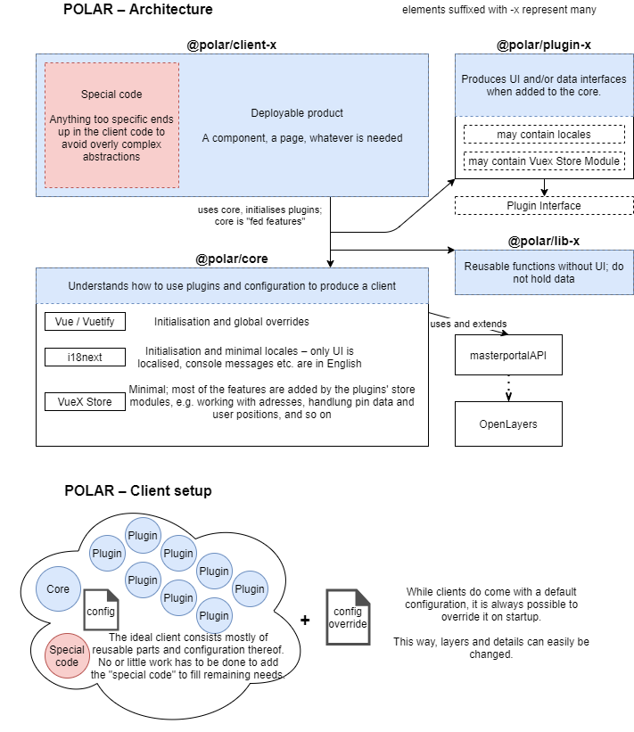

# Architecture documentation

## User perspective
When using POLAR, it behaves a simple fragment that can be used in any web-based setting.
It may either work standalone, in which case there are only inputs for configuration, or as a part of a process, in which case there are both inputs and outputs for further processing.

The purpose of POLAR is to handle all geospatial interactions of a user and utilize the decentralized geospatial infrastructure for that end.

*Viewn from the outside, POLAR is just a component*

## Usage examples
POLAR is designed to increase *application efficiency* and *correctness* for the public sector, but may be used in any form process or as a standalone map client.
The provided _visualisations_ ease communication between citizens and administrative staff, allowing them to effectively share the *where*.

POLAR is already in use for ...

- ... **citizens** to ...
    - communicate parcel data in applications.
    - mark their current position for reports.
    - read information on water levels, bathing spots, and much other public information.
- ... **officials in charge** to ...
    - coordinate city services regarding reports.
    - present governmental data to the public.
    - manage and update department geospatial data.
- ... **developers** to ...
    - heavily reduce implementation time.
    - easily use geospatial systems without domain expertise.
    - use POLAR as component in low code platforms.

## Inner architecture
On the inside, POLAR is constructed from many smaller and isolated packages that each encapsulate a specific part of the business logic.
These parts can be mixed and matched, and are easily replacable for situations where further extension would make them overly complicated.

For client-specific business logic, this can be placed in the very client itself to prevent bloat in other parts of the product.

All in all, this makes POLAR a versatile map client factory.

*Viewn from the inside, POLAR is a map client factory*
