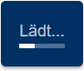

# LoadingIndicator

## Scope

A generic loading indicator that may be used by any plugin or outside procedure to indicate loading.

## Configuration

### LoadingIndicator

| fieldName  | type | description |
| - | - | - |
| loaderStyle | string? | Choose between different loader styles. Defaults to 'v-progress-linear' (Vuetify loader). Possible values are 'CircleLoader', 'RollerLoader', 'SpinnerLoader', 'RingLoader', 'DefaultLoader' and 'none'  |

For details on the `displayComponent` attribute, refer to the [Global Plugin Parameters](../../core/README.md#global-plugin-parameters) section of `@polar/core`.

## Store

### Mutations

```js
// show loading indicator
map.$store.commit('plugin/loadingIndicator/addLoadingKey', key)
// hide loading indicator
map.$store.commit('plugin/loadingIndicator/removeLoadingKey', key)
// change loader style at runtime
map.$store.commit('plugin/loadingIndicator/setLoaderStyle', loaderStyle)
```



The key must be unique and is kept track of via a Set. It can't be added multiple times, and removing it once always removes it altogether. It is advised to use a key like `{my-plugin-or-application-name}-{procedure-name}` to avoid name conflicts. The LoadingIndicator will usually be used for asynchronous code.

As such, **always call `removeLoadingKey` in the `finally` section of your code** to prevent hanging loading indicators.

### Getters

You may desire to listen to whether the loader is currently being shown.

| fieldName | type | description |
| - | - | - |
| loaderStyle | string | The current loader style. |
| showLoader | boolean | Whether the layer is currently shown. |

```js
mapInstance.$store.watch(
    (_, getters) => getters['plugin/loadingIndicator/showLoader'],
    (showLoader) => {
        /* This code is called on showLoader updates. */
    }
)
```
